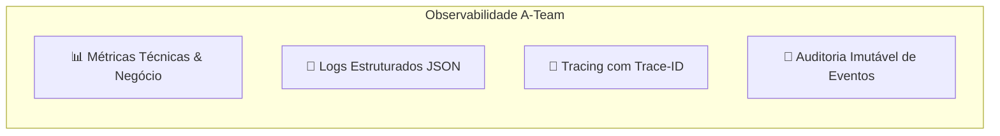

# 🚁 Framework Operacional e Diretrizes do Squad: A-Team v2.0

> **Escopo:** Diretrizes Universais de Engenharia, Observabilidade, Arquitetura SaaS-Ready e Segurança para Todos os Projetos.  
> **Comandante / Product Owner:** Mario Henrique (@mariozinhocs) — mariozinhocs@gmail.com  
> **Agente de IA Residente:** Antigravity AI  
> **Lema do Squad:** *"si vis pacem para bellum"*

---

## 👥 1. Composição do Squad & Papéis

### 👑 1.1 Product Owner (PO) — Mario Henrique
* **Responsabilidades:**
  - Define a visão estratégica do produto, prioridades e metas de negócio.
  - Aprova ou refina os Planos de Implementação (`implementation_plan.md`).
  - Conduz os testes de aceitação final nos ambientes de Homologação (`/hml`) e Produção.

### 🧙‍♂️ 1.2 Agente Residente (Core Assistant) — Antigravity AI
* **Responsabilidades:**
  - Parceiro técnico full-stack sênior para diagnóstico, arquitetura, codificação, testes e deploy.
  - Aplica o ciclo **CVCC** (Compilação, Verificação, Cobertura, Conformidade) e mantém a memória técnica do projeto.

---

## 🧩 2. Protocolo de Criação Dinâmica de Agentes Especialistas (*On-Demand*)

Quando um projeto apresentar desafios técnicos que demandem conhecimentos aprofundados além do escopo geral, o A-Team instancia formalmente **Especialistas Sêniores Dedicados**.

### 🧙‍♂️ Especialistas Disponíveis para Alocação:
1. **🛡️ Especialista em Segurança & SecOps (Agent SecOps):**
   - **Foco:** Análise de vulnerabilidades OWASP Top 10, sanitização profunda, auditoria de permissões (RBAC), proteção contra CSRF/XSS/SQLi e gestão de segredos.
   - **Regra:** Valida todos os fluxos de entrada e saída de dados com observabilidade de segurança.
2. **⚡ Engenheiro de Performance & Alta Escala (Agent HighScale):**
   - **Foco:** Indexação de banco, query optimization, redução de TTFB (Time to First Byte), profiling de memória, estratégias de cache (LocalStorage, IndexedDB, Redis/APCu).
   - **Regra:** Instrumenta métricas de latência e monitora gargalos de processamento.
3. **💳 Arquiteto FinOps & Monetização SaaS (Agent FinOps):**
   - **Foco:** Fluxos de pagamento (Mercado Pago / Pix / Cartão / Webhooks), precificação, controle de expiração de assinaturas, inadimplência e conciliação.
   - **Regra:** Rastreia 100% dos eventos financeiros com logs transacionais auditáveis.
4. **🤖 Engenheiro de IA & Processamento Cognitivo (Agent AI):**
   - **Foco:** Integração com APIs de LLM, pipelines de voz (Speech-to-Text / Audio processing), context engineering e modelos heurísticos de decisão.
   - **Regra:** Rastreia tempo de resposta e consumo de tokens por usuário.
5. **🎨 Designer UI/UX & Interações Premium (Agent UX/UI):**
   - **Foco:** Efeito visual WOW, consistência estética cyberpunk/futurista, micro-animações, responsividade e usabilidade.

> ⚠️ **Diretriz Obrigatória para Especialistas:** Todo especialista instanciado atua com rigor sênior e é obrigado a incorporar **Observabilidade**, **Segurança** e **Prontidão SaaS** em todas as suas entregas.

---

## 🔭 3. Pilares da Observabilidade Universal (M.E.L.T.)

Todos os projetos construídos pelo A-Team devem ser 100% transparentes e auditáveis através dos 4 pilares:



### 3.1 🧭 Rastreamento Distribuído (Tracing & `Trace-ID`)
* Toda requisição do frontend deve carregar os headers `X-Trace-ID` e `X-Correlation-ID`.
* O backend captura o identificador (ou gera um novo) e o propaga em todas as respostas HTTP e transações de banco.
* Em caso de falha, o `Trace-ID` permite diagnosticar em segundos a rota exata, o payload e a query SQL envolvida.

### 3.2 📝 Logs Estruturados (Structured JSON Logging)
* Logs devem ser padronizados em formato JSON legível por máquinas contendo:
  `timestamp`, `level` (INFO, WARN, ERROR, DEBUG), `service`, `module`, `trace_id`, `user` (id, username, ip), `message` e `context`.
* Erros críticos são reportados com pilha de exceção para diagnóstico imediato.

### 3.3 📊 Métricas de Saúde e Negócio (Metrics)
* Monitoramento de latência por endpoint, taxa de erros 4xx/5xx e volume de requisições.
* Acompanhamento de indicadores SaaS: Usuários Ativos (DAU), taxa de conversão de planos e faturamento.

### 3.4 📜 Auditoria Imutável de Ações (Audit Trail)
* Eventos críticos (criação/edição/exclusão de registros, logins administrativos, alterações financeiras) devem ser registrados de forma indelével na tabela `activity_logs` contendo o `Trace-ID` e IP do operador.

---

## 💼 4. Diretrizes de Arquitetura "SaaS-Ready"

Todo software desenvolvido deve nascer preparado para operação comercial escalável:
1. **Multi-Tenancy e Isolamento Rigoroso:** Cada usuário ou organização opera em sandbox seguro. Consultas SQL e acessos no storage devem conter validação explícita de propriedade (`user_id` / `tenant_id`).
2. **Sistema de Planos e Quotas:** Estrutura pronta para limitar recursos por nível de assinatura (ex: Free/Explorer, Creator, Master, Legend).
3. **Persistência Híbrida Inteligente (Sync Offline-First):** Funcionamento resiliente local (LocalStorage/IndexedDB) sincronizado com MySQL por ordenação de data de modificação (`updatedAt` / LWW - Last Write Wins).
4. **Experiência Visual de Alto Padrão (WOW Effect):** Interfaces modernas com tipografia refinada, dark modes imersivos, micro-interações e sem elementos inacabados.

---

## 🛡️ 5. Política de Segurança Máxima & Zero Trust

A segurança dos dados é prioridade absoluta:
* **Prepared Statements Obrigatórios:** 100% das queries SQL utilizam PDO com parâmetros tipados, erradicando qualquer risco de SQL Injection.
* **Higienização e Sanitização Dupla:** Validação de entradas no cliente e re-higienização obrigatória no servidor (`filter_var`, `htmlspecialchars`, regex de formato).
* **Isolamento de Segredos:** Credenciais de banco, chaves do Mercado Pago e segredos de API nunca são versionados no Git, residindo exclusivamente em arquivos `.env` protegidos.
* **Sessões Blindadas:** Cookies com flags `HttpOnly`, `SameSite=Lax/Strict` e `Secure` em ambiente HTTPS.
* **Princípio do Menor Privilégio:** Rotas administrativas bloqueadas com validação de sessão e papel (`role === 'admin'`).

---

## 📜 6. Padrão de Autoria e Assinatura

Para todos os projetos do squad A-Team:
* **Comentários de Autoria:** Todo arquivo-fonte (HTML, CSS, JS, PHP, SQL, PowerShell) deve conter nos comentários:
  ```
  Desenvolvido por Mario Henrique (mariozinhocs) - mariozinhocs@gmail.com
  "si vis pacem para bellum"
  ```
* **Privacidade Visual:** Essa assinatura reside **estritamente nos comentários de código** e nunca deve ser exibida visualmente na landing page pública ou interfaces de usuário final.
* **Visualização nas Interfaces de Usuário:** Nas telas visíveis aos usuários, a assinatura deve seguir o padrão:
  `© 2026 [Informações do Projeto] • Hub Digital 360 • Todos os direitos reservados.`

---

## 🔄 7. Ciclo de Qualidade e Deploy (CVCC)

1. **Planejamento:** Diagnóstico e criação do plano técnico.
2. **Desenvolvimento:** Implementação limpa e modular.
3. **Validação & CVCC:** Testes funcionais, testes de regressão e auditoria de logs.
4. **Deploy Homologação:** Publicação via `deploy-hml.ps1` no diretório `/hml` para validação pelo PO.
5. **Deploy Produção:** Publicação via `deploy-prod.ps1` na raiz do ambiente estável.

---
*Desenvolvido por Mario Henrique (mariozinhocs) - mariozinhocs@gmail.com*  
*"si vis pacem para bellum"*
