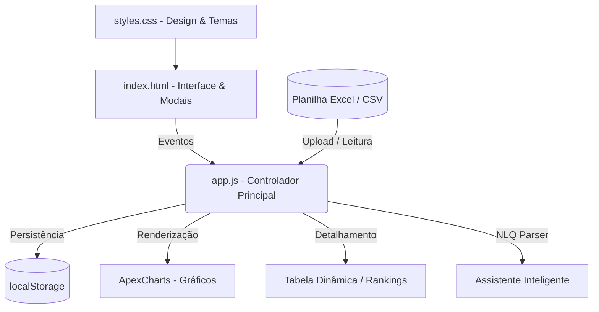

# Memória do Projeto - Controle de Requisições (Dashboard)

Este documento atua como o **registro histórico de arquitetura, decisões técnicas e mapeamento de implementações** para o projeto **Controle de Requisições**. Como o projeto não utiliza Git para controle de versão, este arquivo serve como guia de referência e documentação para identificar alterações significativas e possibilitar procedimentos de **rollback manual** se necessário.

---

## 1. Visão Geral da Arquitetura do Sistema

O projeto é uma aplicação web estática (Client-Side), projetada para funcionar offline e persistir alterações de dados localmente.



### Tecnologias e Bibliotecas Utilizadas:
*   **HTML5 / CSS3 (Vanilla):** Estrutura e estilização com tema dark premium, utilizando variáveis de CSS (`:root`) em [styles.css](file:///g:/Meu%20Drive/Dev's/Controle/styles.css) para cores, tipografia e espaçamentos.
*   **JavaScript (Vanilla - ES6):** Lógica da aplicação concentrada em [app.js](file:///g:/Meu%20Drive/Dev's/Controle/app.js).
*   **SheetJS (xlsx.mini.min.js):** Parser de planilhas `.xlsx` no navegador e gerador/exportador de arquivos Excel.
*   **PapaParse (papaparse.min.js):** Parser rápido para importação de planilhas `.csv`.
*   **ApexCharts (apexcharts.js):** Biblioteca para geração de gráficos responsivos e interativos.

---

## 2. Estrutura do Estado da Aplicação

Toda a reatividade e filtragem do dashboard dependem do objeto global `state` definido no início de [app.js](file:///g:/Meu%20Drive/Dev's/Controle/app.js#L1-L26).

```javascript
const state = {
    rawData: [],      // Registros originais processados
    filteredData: [], // Registros após aplicação dos filtros ativos
    filename: 'Nenhum arquivo carregado',
    filters: {
        zonas: new Set(),        // Filtro multisseletivo de Zonas
        combustiveis: new Set()  // Filtro multisseletivo de Combustíveis
    },
    dateRange: { start: null, end: null },     // Filtro ativo de data
    fullDateRange: { start: null, end: null }, // Extremos de data da planilha carregada
    activeTab: 'lancamentos', // Aba ativa: 'lancamentos', 'responsaveis' ou 'veiculos'
    searchText: '',           // Termo de pesquisa na tabela detalhada
    charts: { donut: null, zonaDonut: null, bar: null, area: null } // Instâncias dos gráficos
};
```

---

## 3. Principais Implementações & Funções Críticas

Abaixo estão as partes mais significativas do código do projeto. Caso ocorram falhas ao modificar estes trechos, consulte os parâmetros e o comportamento esperado descritos abaixo.

### 3.1. Processamento e Sanitização de Dados
*   **Funções principais:** `processData` ([app.js:L581-666](file:///g:/Meu%20Drive/Dev's/Controle/app.js#L581-L666)), `parseExcelBuffer` ([app.js:L379-439](file:///g:/Meu%20Drive/Dev's/Controle/app.js#L379-L439)) e `parseCsvText` ([app.js:L441-490](file:///g:/Meu%20Drive/Dev's/Controle/app.js#L441-L490)).
*   **Descrição:** Transforma linhas lidas do Excel/CSV em objetos normatizados no formato padrão do dashboard. O processamento corrige automaticamente valores brasileiros (ex: converter `R$ 5,89` para float `5.89` usando `parseBrazilianNumber`) e lê datas em formatos variados (com `parseExcelDate`).
*   **Estrutura padrão de cada registro:**
    ```javascript
    {
        id: "timestamp-random-index",
        date: DateObject,
        month: 0-11,
        year: YYYY,
        inicioSeq: "0000000",
        fimSeq: "0000000",
        qtdRequisicoes: Number,
        zona: String,
        responsavel: String,
        veiculo: String,
        placa: String,
        combustivel: String,
        litros: Number,
        precoLitro: Number,
        valor: Number
    }
    ```

### 3.2. Motor de Linguagem Natural (NLQ)
*   **Função principal:** `applyNlqQuery` ([app.js:L798-1001](file:///g:/Meu%20Drive/Dev's/Controle/app.js#L798-L1001)).
*   **Descrição:** Analisa texto digitado pelo usuário e ajusta os filtros e abas dinamicamente.
    *   *Zonas:* Filtra se encontrar termos como "sul", "norte", "leste", "oeste", "centro-sul".
    *   *Combustíveis:* Filtra por "gasolina", "diesel", "etanol".
    *   *Datas:* Reconhece "hoje", "ontem", "7 dias", "30 dias".
    *   *Buscas Específicas:* Encontra nomes comuns de motoristas e termos de veículos, alternando a tabela automaticamente para as abas de ranking correspondentes.

### 3.3. Reatividade e Renderização do Dashboard
*   **Função principal:** `updateDashboard` ([app.js:L1003-1021](file:///g:/Meu%20Drive/Dev's/Controle/app.js#L1003-L1021)).
*   **Descrição:** Centraliza a atualização em cascata. Sempre que um filtro é ativado, `updateDashboard` recalcula o subconjunto de dados (`state.filteredData`), refaz os KPIs principais (`calculateKPIs`), atualiza os quatro gráficos do ApexCharts e redesenha a tabela detalhada (`renderTable`).

### 3.4. Maximizar e Minimizar Gráficos
*   **Função principal:** `toggleMaximizeChart` ([app.js:L1734-1777](file:///g:/Meu%20Drive/Dev's/Controle/app.js#L1734-L1777)).
*   **Descrição:** Insere o gráfico selecionado no modo tela cheia sobreposto por um overlay escuro e ajusta dinamicamente a altura interna da instância do gráfico usando a API do ApexCharts (`chartInstance.updateOptions`).
*   **Impacto no DOM:** Adiciona a classe `.maximized` ao `.chart-card` correspondente e a classe `.active` à `#chart-overlay`.

### 3.5. Persistência de Dados e Operações CRUD
*   **Ações:** Formulário de Inserção ([app.js:L224-269](file:///g:/Meu%20Drive/Dev's/Controle/app.js#L224-L269)) e Exclusão (`deleteRecord` em [app.js:L1775-1782](file:///g:/Meu%20Drive/Dev's/Controle/app.js#L1775-L1782)).
*   **Descrição:** Registros adicionados via modal de Nova Requisição ou excluídos na tabela alteram diretamente `state.rawData` e são salvos serializados em JSON no cache do navegador (`localStorage.setItem('combustivel_dashboard_data')`). Ao recarregar a página, se não encontrar `dados.xlsx` ou `dados.csv`, o sistema automaticamente carrega os dados salvos desse cache.

### 3.6. Geração de Infográfico e Layout de Impressão PDF
*   **Ações:** Abertura do modal e preenchimento de dados (`populateInfografico` em [app.js:L1809-1925](file:///g:/Meu%20Drive/Dev's/Controle/app.js#L1809-L1925)) e regras `@media print` no final de [styles.css](file:///g:/Meu%20Drive/Dev's/Controle/styles.css).
*   **Descrição:** Agrega dados filtrados sob demanda (KPIs consolidados, proporção de combustível/zona e veículos/motoristas de maior consumo) e renderiza em formato de poster vertical. A impressão oculta o restante da tela e expõe uma página única colorida otimizada para PDF.

---

## 4. Guia de Rollback Técnico

Se uma nova atualização de código introduzir bugs, siga os padrões descritos abaixo para reverter a aplicação para um estado estável.

### 4.1. Rollback do Estado e Carregamento (Se o painel parar de renderizar)
Se o carregamento de dados quebrar por conta de modificações em filtros ou leitura, reverta os métodos de parsing para a estrutura padrão:
1.  **Verifique a estrutura do localStorage:** Acesse o Console de Desenvolvedor (F12) -> aba *Aplicativo (Application)* -> *Armazenamento Local (Local Storage)* e inspecione a chave `combustivel_dashboard_data`. Se os dados estiverem corrompidos, limpe-os chamando `localStorage.clear()` no Console e recarregue a página.
2.  **Restaure a leitura original:** A leitura inicial de contingência tenta buscar `./dados.xlsx` e `./dados.csv`. Caso queira desativar o cache de requisições persistidas e forçar a releitura do arquivo local, chame a função `loadInitialData(true)`.

### 4.2. Rollback do Design / CSS (Se o layout perder o alinhamento)
O dashboard utiliza um grid de duas colunas principais (`.app-container` em [styles.css:L90-95](file:///g:/Meu%20Drive/Dev's/Controle/styles.css#L90-L95)):
*   Coluna 1 (Fixa para KPI Sidebar): `280px`
*   Coluna 2 (Flexível para Conteúdo): `1fr`
*   **Gráficos (Grid 2x2):** `.charts-grid` utiliza `grid-template-columns: 1fr 1fr`. Se algum gráfico quebrar o layout, verifique se a classe `.area-card` ainda mantém a propriedade `grid-column: span 2` (que a faz ocupar a largura total inferior).

### 4.3. Restaurando Funções de Exportação
Caso a exportação Excel pare de responder:
*   Certifique-se de que a biblioteca local `libs/xlsx.mini.min.js` e a tag correspondente em `index.html` não foram alteradas ou removidas.
*   A exportação depende da função utilitária `XLSX.utils.json_to_sheet` aplicada a um array de objetos puros mapeados na função `exportToExcel` ([app.js:L1685-1731](file:///g:/Meu%20Drive/Dev's/Controle/app.js#L1685-L1731)).

---

## 5. Log de Versões e Atualizações

Use esta seção para documentar novas alterações manuais à medida que elas forem sendo introduzidas.

*   **Funcionalidade: App Nativo Windows, Autenticação de Licença GitHub, Sidebar Retrátil & Tela Cheia**
    *   *Data:* 19/08/2026
    *   *Implementações:*
        1. **Modo App Nativo no Windows (`abrir_dashboard.bat`):** Atualizado o inicializador para abrir o Edge ou Chrome com a flag `--app="file:///..."`, executando a aplicação em uma janela dedicada sem abas, barra de endereços ou moldura de navegador.
        2. **Validação de Licença via GitHub (`LicenseManager`):** Adicionado modal de autenticação `#license-overlay` no boot se nenhuma chave válida estiver em `localStorage`. A aplicação valida a chave via `fetch` apontando para o GitHub (`keys.json`).
        3. **Gerador Local de Chaves (`gerador_chaves.html` / `keys.json`):** Ferramenta web standalone local para criar chaves aleatórias (`CTRL-2026-XXXX-YYYY`), gerenciar clientes e exportar o arquivo `keys.json` para publicar no GitHub.
        4. **Sidebar Retrátil (Apenas Ícone):** Adicionado o botão `#btn-toggle-sidebar` para alternar a classe `.sidebar-collapsed`. A barra encolhe para 78px mostrando apenas o logo e os números resumidos de KPI, com re-layout automático dos gráficos ApexCharts.
        5. **Modo Tela Cheia Imersivo:** Adicionado o botão `#btn-fullscreen` no cabeçalho acionando a API `requestFullscreen()`.

*   **Funcionalidade: Portabilidade Avançada, Drag-and-Drop, Calendário & Personalização**
    *   *Data:* 17/08/2026
    *   *Implementações:*
        1. Renomeação de "Zonas de Manaus" para "Bases" e inserção de KPI "Maior Consumo (Base)".
        2. Arrastar e soltar (drag-and-drop) para os cards de KPI na sidebar e os painéis de gráficos no grid de relatórios.
        3. Customização de gráficos (alteração de tipos, exibição de rótulos e legendas) através de popovers de preferências rápidos.
        4. Integração portátil: preferências de layout e gráficos salvas em aba extra `"Configuracoes"` do arquivo Excel exportado e lidas no upload de dados para restaurar as posições (preservando o anonimato de dados).
        5. Widget de calendário customizado e interativo para seleção de datas, com fonte em negrito e tamanho maior para datas com consumo registrado.
        6. Bat initializer `abrir_dashboard.bat` para abrir os navegadores em modo anônimo de fábrica.
        7. Impressão aprimorada com botão no topo direito do infográfico e colunas de líderes invertidas e renomeadas ("Maior Consumo (Responsável)" e "Maior Consumo (Veículo)").

*   **Funcionalidade: Gerador de Infográfico Premium**
    *   *Data:* 17/08/2026
    *   *Implementações:* Adicionado o botão "Gerar Infográfico", modal `#infografico-modal` com renderização dinâmica de métricas agregadas (combustíveis, bases, veículos/motoristas líderes) e folha de estilo de impressão (@media print) otimizada para exportação limpa de página única em formato PDF.

*   **Versão Base:**
    *   *Data:* 17/08/2026
    *   *Implementações:* Dashboard Responsivo Completo, Assistente de Busca NLQ (Linguagem Natural), Persistência local no localStorage com operações CRUD em-tela, Gráficos ApexCharts dinâmicos e maximizáveis, e suporte para importação/exportação XLSX e CSV.

